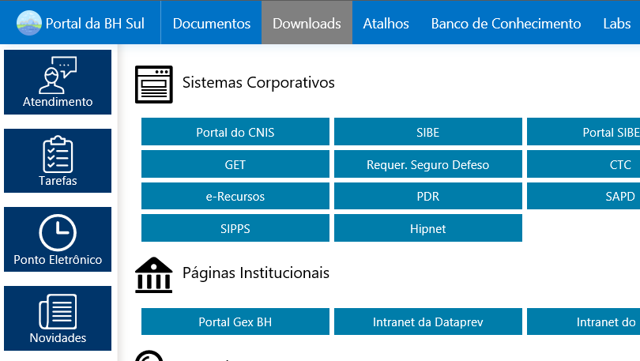

# Portal da BHSul
[](https://dev.azure.com/douglasralmeida/douglasralmeida/_build/latest?definitionId=5)
[](https://github.com/douglasralmeida/pb/releases/latest)

Projeto de intranet corporativa para uso interno no INSS.



## Requisitos:
* Sistema Operacional: Windows, Linux, FreeBSD ou MacOS X.
* Docker.

### Bibliotecas utilizadas:
* jQuery 3.2.1 - http://jquery.com/
* Angular JS 1.6.4 - https://angularjs.org/
* Metro UI CSS 3.0.17 - http://metroui.org.ua/
* FancyBox 3.1.20 - http://fancyapps.com/fancybox/3/

## Para implantar:
```
    docker run --name portalbhsul -d -p 80:80 --restart unless-stopped douglasralmeida/portalbhsul
```

## Para atualizar:
```
    docker pull douglasralmeida/portalbhsul
    docker stop portalbhsul
    docker rm portalbhsul
    docker run --name portalbhsul -d -p 80:80 --restart unless-stopped douglasralmeida/portalbhsul
```

## Para acessar na intranet:
```
    http://10.32.97.160/
```

## Mais informações
[Categorias do Banco de Conhecimento](bob/master/docs/bc-categorias.md)